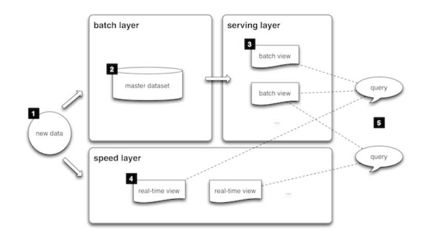
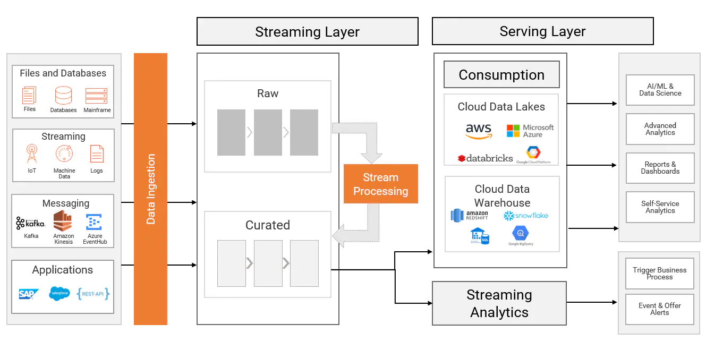

# Summary

- [Lambda Architecture](#lambda-architecture)
- [Kappa Architecture](#kappa-architecture)
- [Delta Architecture](#delta-architecture)
- [Delta Lake](delta_lake.md)
- [Data Warehouse](data_warehouse.md)
- [Datalake](datalake.md)
- [Data Lakehouse](data_lakehouse.md)
- [Data Warehouse vs Datalake](#data-warehouse-vs-datalake)

## Lambda Architecture
Lambda architecture is a way of processing massive quantities of data (i.e. “Big Data”) that provides access to batch-processing and stream-processing methods with a hybrid approach. Lambda architecture is used to solve the problem of computing arbitrary functions. The lambda architecture itself is composed of 3 layers:

    

### Batch Layer
New data comes continuously, as a feed to the data system. It gets fed to the batch layer and the speed layer simultaneously. It looks at all the data at once and eventually corrects the data in the stream layer.  Here we can find lots of ETL and a traditional data warehouse. This layer is built using a predefined schedule, usually once or twice a day. The batch layer has two very important functions:
- To manage the master dataset
- To pre-compute the batch views.

### Serving Layer
The outputs from the batch layer in the form of batch views and those coming from the speed layer in the form of near real-time views get forwarded to the serving.  This layer indexes the batch views so that they can be queried in low-latency on an ad-hoc basis.

### Speed Layer (Stream Layer)
This layer handles the data that are not already delivered in the batch view due to the latency of the batch layer. In addition, it only deals with recent data in order to provide a complete view of the data to the user by creating real-time views.

### Benefits of lambda architectures
Here are the main benefits of lambda architectures:
- **No Server Management** - you do not have to install, maintain, or administer any software.
- **Flexible Scaling** - your application can be either automatically scaled or scaled by the adjustment of its capacity
- **Automated High Availability** - refers to the fact that serverless applications have already built-in availability and faults tolerance. It represents a guarantee that all requests will get a response about whether they were successful or not.
- **Business Agility** - React in real-time to changing business/market scenarios

### Challenges with lambda architectures
- **Complexity** - lambda architectures can be highly complex. Administrators must typically maintain two separate code bases for batch and streaming layers, which can make debugging difficult.

To sum up, Lambda architecture is a popular technique where records are processed by a batch system and streaming system in parallel. The results are then combined during query time to provide a complete answer. Strict latency requirements to process old and recently generated events made this architecture popular. The key downside to this architecture is the development and operational overhead of managing two different systems.

## Kappa Architecture
The Kappa Architecture is a software architecture used for processing streaming data. The main premise behind the Kappa Architecture is that you can perform both real-time and batch processing, especially for analytics, with a single technology stack. It is based on a streaming architecture in which an incoming series of data is first stored in a messaging engine like Apache Kafka. From there, a stream processing engine will read the data and transform it into an analyzable format, and then store it into an analytics database for end users to query.

The Kappa Architecture supports (near) real-time analytics when the data is read and transformed immediately after it is inserted into the messaging engine. This makes recent data quickly available for end user queries. It also supports historical analytics by reading the stored streaming data from the messaging engine at a later time in a batch manner, to create additional analyzable outputs for more types of analysis.

In other words...Kappa architecture is a streaming-first architecture deployment pattern – where data coming from streaming, IoT, batch or near-real time (such as change data capture), is ingested into a messaging system like Apache Kafka. A stream processing engine (like Apache Spark, Apache Flink, etc.) reads data from the messaging system, transforms it, and publishes the enriched data back to the messaging system, making it available for real-time analytics. Additionally, the data is distributed to the serving layer such as a cloud data lake, cloud data warehouse, operational intelligence or alerting systems for self-service analytics and machine learning (ML), reporting, dashboarding, predictive and preventive maintenance as well as alerting use cases.

    

Kappa architecture is not a substitute for Lambda architecture. It is, in fact, an alternative approach for data management within the organization. It can be used in architectures where the batch layer is not needed for meeting the quality of service needs of the organization as well as in the scenarios where complex transformations including data quality techniques can be applied in streaming layer. Kappa architecture is being used in streaming-first deployment patterns where data sources are both batch and real time and where end-to-end latency requirements are very stringent.

### Use cases for adopting Kappa architecture
- **Real-time reporting and dashboarding**: This use case is mainly seen in manufacturing and the oil and gas industry where there is a need to update the aggregated status of the machines in the assembly line for real-time reporting and dashboarding.
- **Real-time rules processing and alerting**: This use case is seen in the retail and telecommunications industry where there is a need to operationalize complex event processing rules on the streaming data from point of sale or e-commerce websites. The result is an alert that is consumed by downstream business applications for triggering real-time campaigns or offer alerts.
- **Real-time machine learning model operationalization**: This is seen in the financial services industry where pre-created fraud detection ML models are executed on the near real-time data from transactional systems to identify potentially fraudulent transactions and alert the customer so remedial actions can be taken.
- **Real time operational Intelligence**: This is seen in asset heavy industries where there is a need to perform edge processing on the data before the enriched data is loaded into the cloud data lake or data warehouse. This helps reducing network traffic, operationalize predictive and preventive maintenance techniques as well as enabling IT/OT data integration for holistic analytics.

### How Do the Kappa and Lambda Architectures Compare?
Both architectures handle real-time and historical analytics in a single environment.

However, one major benefit of the Kappa Architecture over the Lambda Architecture is that it enables you to build your streaming and batch processing system on a single technology. This means you can build a stream processing application to handle real-time data, and if you need to modify your output, you update your code and then run it again over the data in the messaging engine in a batch manner. There is no separate technology to handle the batch processing, as is suggested by the Lambda Architecture.

One advantage of the Lambda Architecture, however, is that much larger data sets (in the petabyte range) can be stored and processed more efficiently in Hadoop for large-scale historical analysis.

## Delta Architecture
Delta architecture assumes that any new streaming records are processed like delta (incremental) records and are not processed as new records. Conceptually this architecture patterns is similar to Lambda as it is based on speed and hot path. The one big difference is that delta architecture no longer considers data lake as immutable, and any batch transformation can update the existing data structures in the data lake (process delta records). This capability makes it easier for cold path to be processed. 

The Delta architecture can be seen as a further evolution of the Kappa architecture, which is based on a data lake and works with structured streaming.

## Data Warehouse vs Datalake
- **Different purposes**. Data Warehouses are used by managers, analysts, and other business end-users, while Data Lakes are mainly used by Data Scientists and Data engineers. Recall that Data Lake stores mostly raw unstructured and semi-structured data — telemetry, graphics, logs of user behavior, website metrics, and information systems, as well as other data with different storage formats. They are not yet suitable for daily analytics in BI systems but can be used by Data Scientists to test new business hypotheses using statistical algorithms and Machine Learning methods.
- **Different processing methods**. ETL is a popular data processing paradigm in many popular data warehousing. Essentially we extract data from a source or sources, clean it up, and convert it into the structured information we need, and upload it. With Data Lakes we use another paradigm ELT(Extract, Load, Transform) because the transformation takes place in the later stages and only if needed not upfront.
- **Different levels of understanding of the data**. In Data Lakes data is never rejected because it is stored in an unprocessed format. This is especially useful in an environment with large data if you do not know in advance what information will be obtained from the data analysis. At the same time, the central database(s) is the foundation of the data warehousing environment. Usually, such databases are implemented on RDBMS technology and therefore the necessary in-depth design of the data model is required.
- **Different approaches to design**. Data Warehouse design is based on relational data handling logic - the third normal form for normalized storage, star or snowflake schemes for storage. When designing the data lake, the Big Data Architect and Data Engineer pay more attention to ETL processes, taking into account the diversity of sources and consumers of information. And the question of storage is solved quite simply - you only need a scalable, fault-tolerant, and relatively cheap file system, such as HDFS or AWS S3.
- **Different price**. Usually, Data Lake is built on the basis of cheap servers with Apache Hadoop, without expensive licenses and powerful equipment, in contrast to a lot of maintenance costs as well as large costs of design and purchase of specialized platforms for Data Warehouse, such as SAP, Oracle, Teradata, etc.

## Referencies
- [Data Lake vs Data Warehouse](https://luminousmen.com/post/data-lake-vs-data-warehouse)
- [Lambda Architecture](https://databricks.com/glossary/lambda-architecture)
- [Introduction to Delta Architecture](https://www.thedigitaltalk.com/blog/2019-9-introduction-to-delta-architecture/)
- [Change from Lambda to Delta Architecture](https://www.ifb-group.com/blog/en/change-from-lambda-to-delta-architecture/)
- [What Is the Kappa Architecture?](https://hazelcast.com/glossary/kappa-architecture/)
- [Kappa Architecture](https://www.informatica.com/blogs/adopt-a-kappa-architecture-for-streaming-and-ingesting-data.html)
- [Kappa Architecture is Mainstream Replacing Lambda](https://www.kai-waehner.de/blog/2021/09/23/real-time-kappa-architecture-mainstream-replacing-batch-lambda/)
