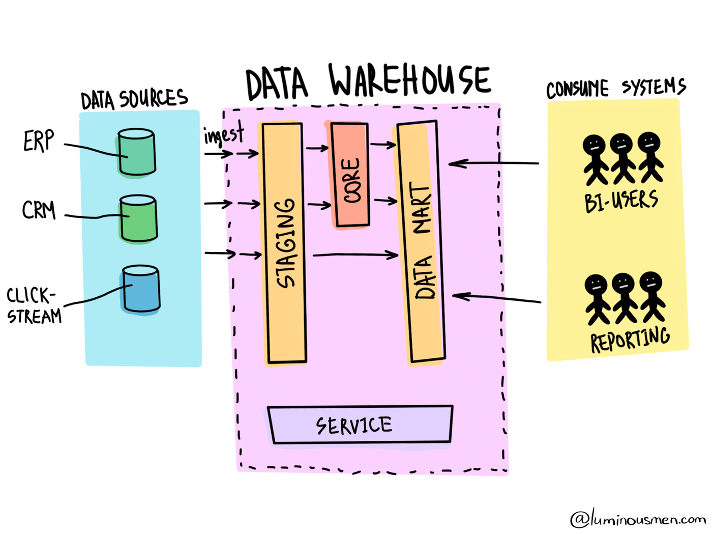

# Data Warehouse
A data warehouse is used to store large amounts of structured data from multiple sources in a centralized place. Organizations invest in building data warehouses because of its ability to deliver business insights from across the company, and quickly.

Data Warehouse has a single repository of data collected from different sources using various ETL processes.

Data sources can be very diverse and have different data representations, which can lead to divergent information (accounting, billing, banking systems). In addition, the large variety of schemas and structures in data sources makes it difficult to obtain consolidated information when a complete snapshot of the data is required from all business sub-systems. In general, this is the main reason for the emergence of Data Warehouse solutions.

You can think of Data Warehouse as a relational database where processed business data is stored, but this will not be entirely true — things are a little bit more complicated. Data Warehouse has a complex multi-level architecture called LSA — Layered Scalable Architecture. LSA implements a logical division of structures with data into several functional levels. The data are copied from level to level and transformed in order to eventually be available as consistent information suitable for analysis.

    

## Modelagem Dimensional

## Tabela Fato
A tabela fato é a principal tabela do Data Warehouse, ela vai conectar nas dimensões. Nessa tabela são armazenadas duas coisas: as métricas, que são os fatos propriamente ditos, e as foreign keys, chaves que servem para ligar os dados das dimensões com a fato. Ou seja, a tabela fato é composta pelas métricas, que são tudo aquilo que a empresa quer medir, junto com as foreign keys, chaves que ligam às dimensões que descrevem essas métricas.

### Métrica
É utilizada para medir, quantificar algo, são sempre números provenientes de transações da empresa. Tudo que a empresa quer mensurar é métrica, geralmente sendo o que o usuário quer medir. Por exemplo: número de vendas ou seguidores em determinada rede social.

### Tipos de Fatos
Existem 6 tipos de fatos:

- Fato transacional
- Fato agregada
- Fato consolidada
- Fato snapshot periódico
- Fato de snapshot acumulado
- Fato sem fato

#### Fato Transacional
Fatos transacionais são as mais comuns. A maioria dos bilhões de linhas que temos no Data Warehouse são de tabelas fato transacional. Elas geralmente utilizam métricas aditivas, aquelas métricas que a gente pode somar por todas as dimensões. A cada transação que ocorre, é inserido uma nova linha. Numa fato de vendas, cada item de uma venda vai ser salvo em uma linha da fato.

#### Fato Agregada
Essa fato tem a função de acelerar o desempenho das consultas. Ela serve para juntar um bolo de dados quando não se deseja analisar no nível do grão. Um exemplo é um criar uma fato de número de visitantes de um determinado site, tendo dimensões ligando para cada página. Desta forma evita deixar o trabalho para ferramenta de BI de consolidar o número de visitantes por página, pois já seria calculado conforme é inserido na tabela fato.

#### Fato Consolidada
Essa é bem parecida com a agregada, mas serve para combinar 2 tipos de processos. Processo é a área de negócio, área de assunto, processo de negócio. Diferente da fato agregada, que serve para consolidar as coisas. A fato consolidada é para consolidar duas fatos. Mas isto não é feito utilizando *join*. O que acontece é que no processamento do ETL, na hora de carregar a tabela fato, você vai carregar uma, carregar a outra, e misturar as duas. Evidente que o grão precisa ser o mesmo.

#### Fato Snapshot Periódico
Ele é baseado no tempo, seja data, dia, semana ou hora. É um processo que é feito em cima de outra tabela fato. A ideia é criar uma espécie de agregação dos eventos e trazer de forma resumida para uma nova tabela fato. Os mesmos valores encontrados nesta nova tabela fato poderiam ser inferidos a partir da transacional, porém com maior custo computacional.

#### Fato de Snapshot Acumulado
Qual a diferença de um snapshot acumulado para periódico? O periódico pega o momento no período, tira uma fotografia e insere na fato. O acumulado também é uma fotografia, mas em mais de um momento.

#### Fato sem Fato
Uma tradução pro nosso dia a dia seria fato sem métricas. Ela também é chamada de fato de associação ou de intersecção, mas o termo técnico é fato sem fato ou factless fact table. Serve para fazer uma intersecção de dimensões. Às vezes a gente quer comparar ou cruzar algo somente entre duas dimensões e não tem uma métrica para fazer essas comparações. Essa tabela fato é a exceção, só é usada quando se precisa fazer uma intersecção entre as dimensões.

## Dimensões
 Dimensão discreta ou Medição contínua (mais comum) ou Dimensão contínua ou Medição discreta (menos comum). 

## Referências
- [Data Warehouse - Modelagem Dimensional](https://rafaelpiton.com.br/blog/data-warehouse-modelagem-dimensional/)
- [Data Warehouse - O que é Tabela Fato](https://rafaelpiton.com.br/blog/data-warehouse-tipos-fatos/)
- [Differences Between a Data Warehouse, Data Lake, and a Database](https://www.confluent.io/learn/databases-data-lakes-and-data-warehouses-compared/)
- [Data Lake vs Data Warehouse](https://luminousmen.com/post/data-lake-vs-data-warehouse)
