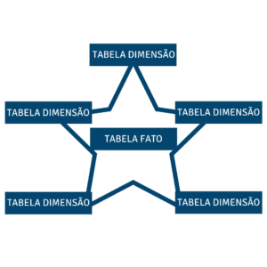

# Data Warehouse
A data warehouse is used to store large amounts of structured data from multiple sources in a centralized place. Organizations invest in building data warehouses because of its ability to deliver business insights from across the company, and quickly.

Data Warehouse has a single repository of data collected from different sources using various ETL processes.

Data sources can be very diverse and have different data representations, which can lead to divergent information (accounting, billing, banking systems). In addition, the large variety of schemas and structures in data sources makes it difficult to obtain consolidated information when a complete snapshot of the data is required from all business sub-systems. In general, this is the main reason for the emergence of Data Warehouse solutions.

You can think of Data Warehouse as a relational database where processed business data is stored, but this will not be entirely true - things are a little bit more complicated. Data Warehouse has a complex multi-level architecture called LSA - Layered Scalable Architecture. LSA implements a logical division of structures with data into several functional levels. The data are copied from level to level and transformed in order to eventually be available as consistent information suitable for analysis.

É importante avisar que mesmo o Data Warehouse vindo em um estágio depois do ETL, você deve se preocupar com ele antes. O ETL só vai poder ser feito depois que o Data Warehouse estiver pronto, porque é ele quem define de que forma os dados vão ser transformados e onde deverão ser inseridos. Em suma, Data Warehouse é quem centraliza os dados da empresa e elimina os ruídos de comunicação entre os departamentos, deixando tudo unificado. O Data Warehouse é todo planejado com foco na tomada de decisão e no que o negócio precisa. O Data Warehouse é a parte mais crítica nos projetos de BI. E por isso é tão necessário ter uma boa habilidade de modelagem de Data Warehouse, porque se você errar nessa parte, vai comprometer o ETL, a construção dos cubos, a própria criação dos dashboards e, principalmente, vai fazer com que erre também na entrega da tomada de decisão.

    

## Modelagem Dimensional
Modelagem dimensional é uma das técnicas e conhecimentos mais utilizados e mais importantes para modelar o Data Warehouse.

Num modelo transacional, você tem que ter integridade dos dados, eles não podem se repetir. Já no modelo dimensional, eles podem. Na verdade, eles devem porque nesse caso ele é desenhado para melhorar o desempenho das consultas, porque o Data Warehouse é feito para consulta, enquanto o operacional é feito para transação.

Existem dois tipos de metodologias de modelagem de dados usadas no Data Warehouse, a Snowflake e a Star Schema, que é a mais utilizada. O Snowflake também é projetado para suportar tomada de decisão, mas economizando espaço em disco. Para o Star Schema, o Snowflake é apenas mais um tipo de dimensão. Embora o Star Schema ocupe mais espaço em disco, ele é mais fácil de implementar e acabou sendo mais utilizado porque além de hoje em dia o espaço ser muito barato, ele permite entregar projetos por pedacinhos.

### Star Schema
O conceito de Star Schema, ou esquema estrela, foi idealizado por Ralph Kimball. A ideia dele é propor uma visão para modelagem de base de dados para sistemas de apoio à decisão. Lembra que o Data Warehouse suporta a tomada de decisão e a modelagem dimensional também? O Star Schema, na sua essência, é isso. O esquema estrela é composto no centro por uma tabela fato, que é rodeada por dimensões. Por isso que tem o nome de Star Schema, porque parece uma estrela.

    

No Star Schema os dados são modelados em tabelas dimensionais, ligadas a uma fato. **As tabelas dimensão contêm as características de um evento**. Por exemplo, quando eu faço uma venda, quero saber por onde a venda foi feita, que produto foi vendido, ou para quem. **Já a tabela fato armazena o que ocorreu**, é o fato propriamente dito, por isso ela tem esse nome, porque é o fato ocorrido. A tabela fato está sempre ligada a duas ou mais dimensões, não existe tabela fato com menos de duas dimensões. A tabela fato conecta com as dimensões e isso forma o modelo dimensional. Ela também é a principal tabela no modelo dimensional. 

Quando são feitas consultas, elas ocorrem primeiro nas tabelas de dimensão e depois na fato. É comum quem trabalha com BI acreditar que a consulta começa pela fato, mas você não vai cometer esse erro. É na tabela fato onde as métricas são armazenadas.

#### Tabela Fato
A tabela fato é a principal tabela do Data Warehouse, ela vai conectar nas dimensões. Nessa tabela são armazenadas duas coisas: as métricas, que são os fatos propriamente ditos, e as foreign keys, chaves que servem para ligar os dados das dimensões com a fato. Ou seja, a tabela fato é composta pelas métricas, que são tudo aquilo que a empresa quer medir, junto com as foreign keys, chaves que ligam às dimensões que descrevem essas métricas.

##### Métrica
É utilizada para medir, quantificar algo, são sempre números provenientes de transações da empresa. Tudo que a empresa quer mensurar é métrica, geralmente sendo o que o usuário quer medir. Por exemplo: número de vendas ou seguidores em determinada rede social.

##### Tipos de Fatos
Existem 6 tipos de fatos:

- Fato transacional
- Fato agregada
- Fato consolidada
- Fato snapshot periódico
- Fato de snapshot acumulado
- Fato sem fato

###### Fato Transacional
Fatos transacionais são as mais comuns. A maioria dos bilhões de linhas que temos no Data Warehouse são de tabelas fato transacional. Elas geralmente utilizam métricas aditivas, aquelas métricas que a gente pode somar por todas as dimensões. A cada transação que ocorre, é inserido uma nova linha. Numa fato de vendas, cada item de uma venda vai ser salvo em uma linha da fato.

###### Fato Agregada
Essa fato tem a função de acelerar o desempenho das consultas. Ela serve para juntar um bolo de dados quando não se deseja analisar no nível do grão. Um exemplo é um criar uma fato de número de visitantes de um determinado site, tendo dimensões ligando para cada página. Desta forma evita deixar o trabalho para ferramenta de BI de consolidar o número de visitantes por página, pois já seria calculado conforme é inserido na tabela fato.

###### Fato Consolidada
Essa é bem parecida com a agregada, mas serve para combinar 2 tipos de processos. Processo é a área de negócio, área de assunto, processo de negócio. Diferente da fato agregada, que serve para consolidar as coisas. A fato consolidada é para consolidar duas fatos. Mas isto não é feito utilizando *join*. O que acontece é que no processamento do ETL, na hora de carregar a tabela fato, você vai carregar uma, carregar a outra, e misturar as duas. Evidente que o grão precisa ser o mesmo.

###### Fato Snapshot Periódico
Ele é baseado no tempo, seja data, dia, semana ou hora. É um processo que é feito em cima de outra tabela fato. A ideia é criar uma espécie de agregação dos eventos e trazer de forma resumida para uma nova tabela fato. Os mesmos valores encontrados nesta nova tabela fato poderiam ser inferidos a partir da transacional, porém com maior custo computacional.

###### Fato de Snapshot Acumulado
Qual a diferença de um snapshot acumulado para periódico? O periódico pega o momento no período, tira uma fotografia e insere na fato. O acumulado também é uma fotografia, mas em mais de um momento.

###### Fato sem Fato
Uma tradução pro nosso dia a dia seria fato sem métricas. Ela também é chamada de fato de associação ou de intersecção, mas o termo técnico é fato sem fato ou factless fact table. Serve para fazer uma intersecção de dimensões. Às vezes a gente quer comparar ou cruzar algo somente entre duas dimensões e não tem uma métrica para fazer essas comparações. Essa tabela fato é a exceção, só é usada quando se precisa fazer uma intersecção entre as dimensões.

#### Tabela Dimensão
Dimensão, também chamado de qualificador, descreve o fato ocorrido, ela contém as características do evento. Por exemplo, quando eu faço uma venda, quero saber por onde a venda foi feita, que produto foi vendido ou para quem. **Elas vão qualificar, classificar ou descrever os dados que estão nas fatos, ou seja, as métricas.**

Para identificar as dimensões, normalmente perguntamos pelo que o usuário quer mensurar uma informação. Elas vão ser toda e qualquer informação que qualifique uma métrica ou medida. Você também pode usar a pergunta de quais filtros o usuário gostaria de ter naquela visão. E embora nem todo filtro seja uma dimensão, podem ser dimensões candidatas, que ainda não foram colocadas no modelo mas são candidatas a se tornar dimensões.

As dimensões armazenam 3 coisas:

- A Surrogate Key
- A Natural Key
- Os atributos

Para ser rápida, a fato só armazena os número brutos. O atributo é o que qualifica as métricas, porque elas jogadas lá na fato sozinhas não servem de nada, não dá para tomar decisão nenhuma. Os atributos podem ser campos como cidade, estado, país etc.

Quanto às chaves, a **Surrogate Key é uma Primary Key na dimensão**. É uma chave artificial auto incremental, ou seja, toda vez que ela é chamada, adiciona um número e vai somando.

Já a Natural Key é a Primary Key daquele dado na origem ou legado, é o que você vai usar para identificar de onde aquele dado veio.

## Dimensões
 Dimensão discreta ou Medição contínua (mais comum) ou Dimensão contínua ou Medição discreta (menos comum). 

## Referências
- [Data Warehouse - O que é](https://rafaelpiton.com.br/blog/data-warehouse-o-que-e/)
- [Data Warehouse - Modelagem Dimensional](https://rafaelpiton.com.br/blog/data-warehouse-modelagem-dimensional/)
- [Star Schema](https://rafaelpiton.com.br/blog/data-warehouse-star-schema/)
- [Tipos de dimensões](https://rafaelpiton.com.br/blog/data-warehouse-tipos-dimensoes/)
- [Data Warehouse - O que é Tabela Fato](https://rafaelpiton.com.br/blog/data-warehouse-tipos-fatos/)
- [Differences Between a Data Warehouse, Data Lake, and a Database](https://www.confluent.io/learn/databases-data-lakes-and-data-warehouses-compared/)
- [Data Lake vs Data Warehouse](https://luminousmen.com/post/data-lake-vs-data-warehouse)
