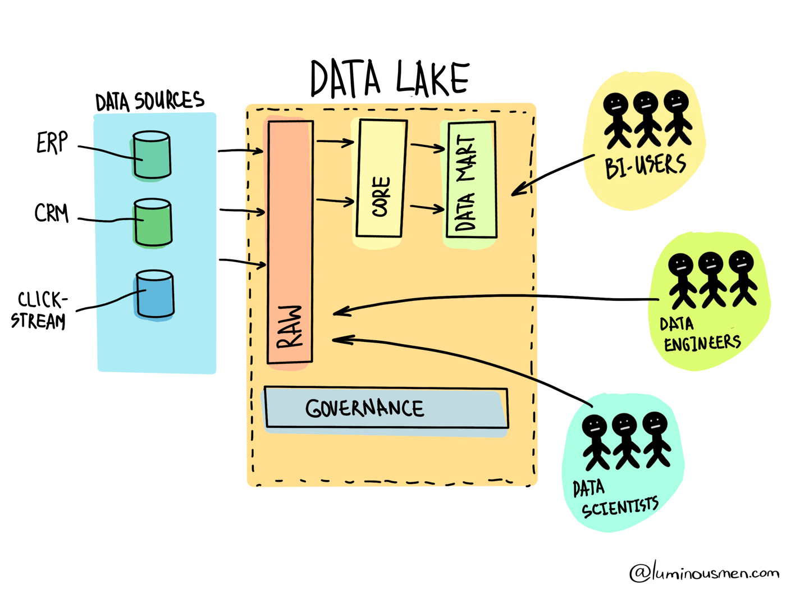

# Datalake
A data lake stores structured, semi-structured and unstructured data, supporting the ability to store raw data from all sources without the need to process or transform it at that time.

Only when the data needs to be retrieved, will some structure need to be applied, which is ideal in the hands of data scientists and data analysis developers who can create new data models on the fly but does not provide the same reporting capabilities and ease of use for business users. Storing data in data lakes is **much cheaper** than in a data warehouse. Data lakes are very popular in the modern stack because of its flexibility and costs but they are **not a replacement** for data warehouses or relational databases.

Although Data Warehouses can handle unstructured data, they cannot do so efficiently. When you have a large amount of data, storing it in a database or Data Warehouse can be expensive. In addition, the data that comes into the Data Warehouses must be processed before it can be stored in some schema or structure. In other words, it should have a Data Model which is not always possible.

    

Lakes are better choices for storing large amounts of records in case someone wants access to a few or many of them in the future. Regulatory compliance is a common use case.

## Referências
- [Data Lake vs Data Warehouse](https://luminousmen.com/post/data-lake-vs-data-warehouse)
- [Understanding when to use a database, data lake, or data warehouse](https://venturebeat.com/2021/04/28/understanding-when-to-use-a-database-data-lake-or-data-warehouse/)
